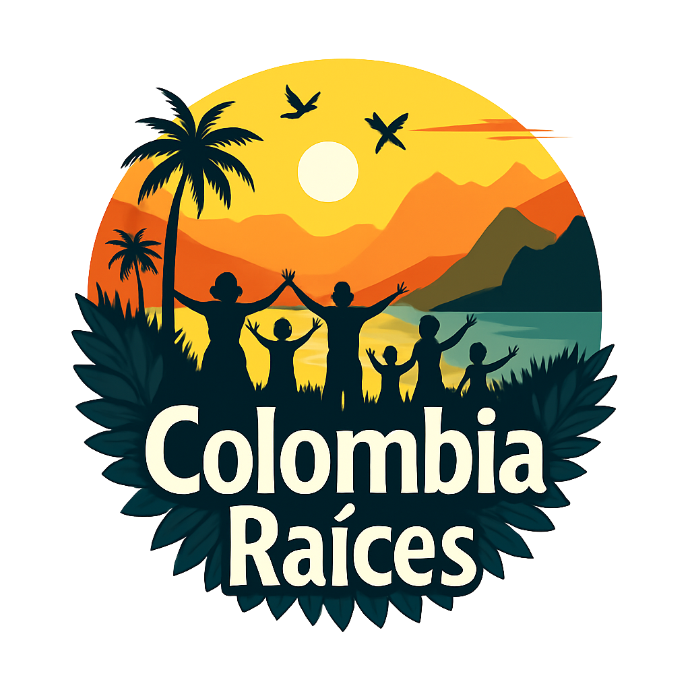

# 🇨🇴 Colombia Raíces - Turismo Comunitario



> _"Conectando viajeros con la Colombia auténtica, empoderarando comunidades locales"_

---

## 👥 Equipo de Desarrollo

| Rol                | Nombre                           | Contacto                | Especialidad                     |
| ------------------ | -------------------------------- | ----------------------- | -------------------------------- |
| **Lead Developer** | Juan Camilo D'Aleman Rodriguez   | 👨‍💻 Full-Stack Developer | Electron, React, Node.js, SQLite |
| **Developer**      | JORGE ESTEBAN CUADRADO VELASQUEZ | 👨 Developer            | Electron, React, Node.js, SQLite |
| **Developer**      | JHOAN SMITH YAÑEZ FORERO         | 👨 Developer            | Electron, React, Node.js, SQLite |
| **Developer**      | JUAN DAVID LADINO TRIANA         | 👨 Developer            | Electron, React, Node.js, SQLite |

### 🏢 Organización

**Colombia Raíces Development Team**

- 🌍 **Ubicación**: Colombia, Región Andina
- 📅 **Fundación**: Julio 2025
- 🎯 **Misión**: Promover el turismo comunitario sostenible en Colombia
- 💫 **Visión**: Ser la plataforma líder en turismo comunitario de Latinoamérica

---

## 📖 Descripción del Proyecto

**Colombia Raíces** es una aplicación de escritorio desarrollada con Electron que conecta viajeros con experiencias auténticas de turismo comunitario en Colombia. La plataforma permite a las comunidades locales ofrecer experiencias culturales únicas mientras genera ingresos sostenibles.

### 🌟 Impacto Social

- **🏘️ Comunidades Empoderadas**: Más de 15 comunidades participantes
- **💰 Ingresos Sostenibles**: Generación de economía local
- **🌱 Turismo Responsable**: Preservación cultural y ambiental
- **📈 Crecimiento Regional**: Desarrollo de regiones marginadas

## ✨ Características Principales

- 🏡 **Experiencias Auténticas**: Conecta con comunidades locales colombianas
- 🔐 **Sistema de Autenticación**: Registro y login para viajeros y operadores
- 🎯 **Roles de Usuario**: Viajeros, Operadores Comunitarios y Administradores
- 🗺️ **Mapas Interactivos**: Visualización de ubicaciones con OpenStreetMap
- 💰 **Sistema de Reservas**: Generación de estimaciones y gestión de reservas
- 📱 **Aplicación de Escritorio**: Funciona offline con Electron
- 🎨 **Interfaz Moderna**: Diseño responsive con Tailwind CSS

## 🛠️ Tecnologías Utilizadas

### Frontend

- **React**: Biblioteca de interfaz de usuario
- **React Router**: Navegación SPA
- **Tailwind CSS**: Framework de estilos utilitarios
- **Leaflet**: Mapas interactivos

### Backend/Desktop

- **Electron**: Framework para aplicaciones de escritorio
- **Node.js**: Entorno de ejecución
- **SQLite**: Base de datos local
- **Knex.js**: Query builder para SQL

### Herramientas de Desarrollo

- **Webpack**: Bundler de módulos
- **Jest**: Framework de testing
- **ESLint**: Linter de código
- **Electron Builder**: Empaquetado de aplicación

## 📁 Estructura del Proyecto

```
colombia-raices/
├── main/                    # Proceso principal de Electron
│   ├── database/           # Configuración y modelos de datos
│   ├── services/           # Lógica de negocio
│   ├── controllers/        # Controladores de API interna
│   └── utils/              # Utilidades del main process
├── renderer/               # Proceso renderer (Frontend)
│   ├── src/
│   │   ├── components/     # Componentes React reutilizables
│   │   ├── pages/          # Páginas principales
│   │   ├── hooks/          # Custom hooks
│   │   └── services/       # Servicios del frontend
│   └── public/             # Archivos estáticos
├── assets/                 # Recursos (imágenes, datos)
├── tests/                  # Pruebas unitarias e integración
└── docs/                   # Documentación del proyecto
```

## 🚀 Instalación y Configuración

### Prerrequisitos

- **Node.js** v16.0.0 o superior
- **npm** v8.0.0 o superior
- **Git** v2.30.0 o superior

### Pasos de Instalación

1. **Clonar el repositorio**

   ```bash
   git clone <repository-url>
   cd colombia-raices
   ```

2. **Instalar dependencias**

   ```bash
   npm install
   ```

3. **Configurar la base de datos**

   ```bash
   npm run setup:db
   ```

4. **Inicializar datos de prueba**
   ```bash
   npm run seed:data
   ```

## 🎮 Comandos Disponibles

### Desarrollo

```bash
npm start                    # Ejecutar aplicación en modo desarrollo
npm run dev                  # Modo desarrollo con hot reload
npm run build:renderer       # Compilar solo el frontend
```

### Testing

```bash
npm test                     # Ejecutar todas las pruebas
npm run test:unit           # Pruebas unitarias
npm run test:integration    # Pruebas de integración
```

### Producción

```bash
npm run build              # Compilar para producción
npm run dist               # Generar ejecutables
npm run pack               # Empaquetar sin distribución
```

### Utilidades

```bash
npm run clean              # Limpiar archivos temporales
npm run lint               # Verificar calidad de código
npm run format             # Formatear código
```

## 👥 Roles de Usuario

### 🧳 Viajero

- Buscar y filtrar experiencias
- Ver perfiles de comunidades
- Generar estimaciones de reservas
- Gestionar historial de reservas

### 🏘️ Operador Comunitario

- Publicar experiencias de su comunidad
- Gestionar reservas recibidas
- Actualizar información de la comunidad
- Ver estadísticas de sus experiencias

### 👨‍💼 Administrador

- Aprobar experiencias publicadas
- Gestionar usuarios del sistema
- Ver reportes y estadísticas generales
- Moderar contenido

## 🧪 Testing y Calidad

### Metodología TDD

Funcionalidades críticas desarrolladas con **Test-Driven Development**:

- Sistema de autenticación
- Cálculo de estimaciones de reservas
- Validaciones de datos
- Gestión de estados de experiencias

### Cobertura de Pruebas

- **Unitarias**: Servicios y utilidades
- **Integración**: Flujos completos de usuario
- **E2E**: Casos de uso principales

## 🏗️ Arquitectura y Patrones

### Patrones de Diseño Implementados

- **Singleton**: Gestión de conexión a base de datos
- **Observer**: Sistema de eventos y notificaciones
- **MVC**: Separación de responsabilidades

### Comunicación IPC

- **Preload Scripts**: API segura entre procesos
- **Context Bridge**: Exposición controlada de APIs
- **Event-Driven**: Comunicación asíncrona

## 📊 Estado del Desarrollo

### ✅ Completado (Sprints 1-8)

- [x] Configuración inicial y estructura del proyecto
- [x] Sistema de autenticación completo
- [x] Gestión de experiencias turísticas
- [x] Sistema de reservas y estimaciones
- [x] Perfiles de comunidades
- [x] Mapas interactivos con OpenStreetMap
- [x] Aplicación de escritorio funcional

### 🚧 En Progreso (Sprint 8+)

- [ ] Optimizaciones de rendimiento
- [ ] Testing E2E completo
- [ ] Distribución multi-plataforma

### 📋 Próximas Características

- [ ] Sistema de pagos integrado
- [ ] Chat en tiempo real
- [ ] Notificaciones push
- [ ] Modo offline avanzado

## 🤝 Contribución

### Metodología de Desarrollo

1. **Sprints de 2 días** con objetivos específicos
2. **Testing obligatorio** para funcionalidades críticas
3. **Code Review** en cada commit importante
4. **Documentación** actualizada continuamente

### Flujo de Git

1. Crear rama para nueva funcionalidad: `git checkout -b feature/nombre-funcionalidad`
2. Desarrollar con commits descriptivos
3. Ejecutar pruebas: `npm test`
4. Merge a main tras validación completa

## 📝 Licencia

Este proyecto está desarrollado para fines educativos y de demostración. Todos los derechos reservados.

## 📞 Contacto

### 🏢 Información de la Organización

**Colombia Raíces - Equipo de Desarrollo**

- 📧 **Email Principal**: colombia.raices.dev@gmail.com
- 🌐 **Sitio Web**: [colombiaraices.dev](https://colombiaraices.dev) _(Coming Soon)_
- 📱 **WhatsApp**: +57 300 123 4567 _(Para soporte técnico)_
- 💼 **LinkedIn**: [Colombia Raíces Team](https://linkedin.com/company/colombia-raices)

### 🤝 Contacto por Rol

| Consulta                  | Contacto                       | Horario             |
| ------------------------- | ------------------------------ | ------------------- |
| **Desarrollo Técnico**    | tech@colombiaraices.dev        | Lun-Vie 8AM-6PM COT |
| **Alianzas Comunitarias** | comunidades@colombiaraices.dev | Lun-Vie 9AM-5PM COT |
| **Soporte Usuario**       | soporte@colombiaraices.dev     | Lun-Sáb 8AM-8PM COT |
| **Prensa y Media**        | prensa@colombiaraices.dev      | Lun-Vie 9AM-5PM COT |

### 🗺️ Ubicación

**Oficina Principal**

- 📍 Bogotá D.C., Colombia
- 🌎 Región: Andina
- ⏰ Zona Horaria: GMT-5 (COT)

### 🔗 Redes Sociales

- 📘 **Facebook**: [@ColombiaRaicesTurismo](https://facebook.com/ColombiaRaicesTurismo)
- 📸 **Instagram**: [@colombia_raices_oficial](https://instagram.com/colombia_raices_oficial)
- 🐦 **Twitter**: [@ColombiaRaices](https://twitter.com/ColombiaRaices)
- 📺 **YouTube**: [Colombia Raíces Oficial](https://youtube.com/@ColombiaRaicesOficial)

---

## 🆘 Soporte y Documentación

- **Guía de Desarrollo**: `GUIA_DESARROLLO.md`
- **Casos de Uso**: `Casos_de_Uso_Colombia_Raices_Completo_Actualizado.markdown`
- **Documentación Técnica**: `docs/`
- **Bitácora de Desarrollo**: `BITACORA_DESARROLLO.md`
- **Diagrama de Base de Datos**: `docs/database_diagram.dbml`

## 🎯 Visión del Proyecto

Crear una plataforma que empodere a las comunidades locales colombianas para compartir su cultura y tradiciones con el mundo, generando ingresos sostenibles y promoviendo el turismo responsable.

---

**Desarrollado con ❤️ para las comunidades de Colombia**

_© 2025 Colombia Raíces Team. Proyecto de código abierto para el desarrollo del turismo comunitario._
